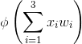

# A Basic Neural Network Perceptron

## Run this code

1. `git clone git@github.com:MichaelH10991/Neural-Network.git`
2. `pip install -r requirements.txt`
3. `python3 main.py`

## The Neural Network

- The network receives a series of x values between 0 and 1
- The weights (w) are initialized to random numbers
- The main neuron performs some processing on the inputs and weights
  - The neuron calculates a weighted sum of the inputs and normalizes the result by perfoming this: 
